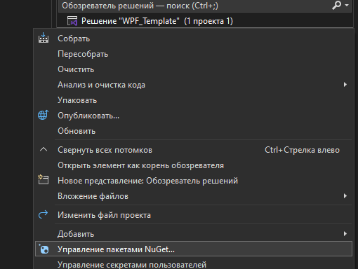
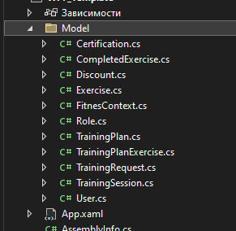

# Создание шаблона WPF приложения для подключения базы данных

1)  Создание проекта

{width="5.1361329833770775in"
height="1.0001399825021873in"}

2)  Выбираем NET 8.0

{width="3.7104910323709537in"
height="1.1687259405074366in"}

3)  Устанавливаем требуемые пакеты

{width="3.589536307961505in"
height="2.7027088801399826in"}

{width="6.268055555555556in"
height="1.7118055555555556in"}

4)  Стягиваем базу данных

> 4.1) Открываем консоль диспетчера пакетов

{width="4.824721128608924in"
height="4.2442158792650915in"}

**Пример команды:**

Scaffold-DbContext
\"Host=localhost;Port=5432;Username=postgres;Password=111;Database=ucheb\"
-O Model Npgsql.EntityFrameworkCore.PostgreSQL

**Если вы всё правильно сделали,** то у вас появятся модели базы данных:

{width="6.268055555555556in" height="0.84375in"}\
{width="2.202141294838145in"
height="2.1491699475065618in"}
